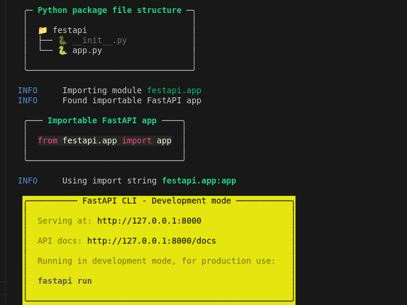

# Aulas do curso de FastAPI Dunossauro

## Aula 01 - Configuração do ambiente e hello world com testes

1º Foi criado o ambiente inicial com comando do poetry
``
poetry new fastapi
``

Mudamos a versão do poetry para "3.12.*" no arquivo pyproject.toml

No terminal, eu devo mudar a versão do python. Isso vai criar o .python-version

```
pyenv local 3.12.4
```

Na pasta fastapi é o pacote que terá com todos os arquivos do projeto. 

2º Ambiente virtual com o comando poetry install

```
poetry install 
```

Ativando ambiente virtual

```
$ poetry shell
Spawning shell within .../virtualenvs/festapi--uhppGGl-py3.12
. .../virtualenvs/festapi--uhppGGl-py3.12/bin/activate
$ . .../virtualenvs/festapi--uhppGGl-py3.12/bin/activate
```

3º Adicionando o FastAPI.

Isso vai gerar as dependências abstratas do FastApi. E dentro do poetry.lock ficam as dependências concretas, com as versões exatas instaladas da lib e de suas dependências. 
Devo subir o poetry.lock? Sim

```
poetry add fastapi
```

4º Escreva a 1ª função no festapi/app.py. Vamos então testar tudo pelo shell.

```
$ python -i festapi/app.py 
>>> read_root()
{'message': 'Hello World'}
```

A função do framework Web é entregar essa resposta de código à internet! E é por meio do instanciamento do FastApi que conseguimos obter a estrutura de uma aplicação web.

5º Subindo servidor de desenvolvimento

```
fastapi dev festapi/app.py
```



Agora temos enpoint /docs e /redoc. O primeiro é mais bonito e o segundo é mais funcional.

6º Ferramentas de desenvolvimentos

ruff: é um linter e um formatador!
pytest: e taskipy!

```
Instalação apenas para desenvolvimento deve ser identificada com --group!

```
$ poetry add --group dev ruff
```